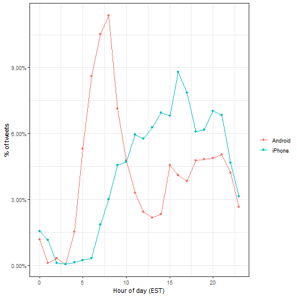

## 1. INTRODUCTION

In this project, we analyse Donald Trump's twitter, focusing on the period when he announced his campaign till election date. We will then perform a sentimental analysis and draw insights from the data.

## 2. METHODS AND ANALYSIS

### 2.1 Work Environment and Data Preparation

We are going to use the following libraries:


```r
if(!require(tidyverse)) 
  install.packages("tidyverse", repos = "http://cran.us.r-project.org")
if(!require(ggplot2)) 
  install.packages("ggplot2", repos = "http://cran.us.r-project.org")
if(!require(lubridate)) 
  install.packages("lubridate", repos = "http://cran.us.r-project.org")
if(!require(tidyr)) 
  install.packages("tidyr", repos = "http://cran.us.r-project.org")
if(!require(scales)) 
  install.packages("scales", repos = "http://cran.us.r-project.org")
if(!require(dslabs)) 
  install.packages("dslabs", repos = "http://cran.us.r-project.org")
if(!require(tidytext)) 
  install.packages("tidytext", repos = "http://cran.us.r-project.org")
if(!require(textdata)) 
  install.packages("textdata", repos = "http://cran.us.r-project.org")
if(!require(RSentiment)) 
  install.packages("RSentiment", repos = "http://cran.us.r-project.org")
```

```
## Warning in library(package, lib.loc = lib.loc, character.only = TRUE,
## logical.return = TRUE, : there is no package called 'RSentiment'
```

```
## Warning in install.packages :
##   unable to access index for repository https://cran.rstudio.com/src/contrib:
##   cannot open URL 'https://cran.rstudio.com/src/contrib/PACKAGES'
## Warning in install.packages :
##   unable to access index for repository http://cran.us.r-project.org/src/contrib:
##   cannot open URL 'http://cran.us.r-project.org/src/contrib/PACKAGES'
## Warning in install.packages :
##   package 'RSentiment' is not available (for R version 3.6.1)
## Warning in install.packages :
##   unable to access index for repository http://cran.us.r-project.org/bin/windows/contrib/3.6:
##   cannot open URL 'http://cran.us.r-project.org/bin/windows/contrib/3.6/PACKAGES'
```

Next we shall download and wrangle the data


```r
url <- 'http://www.trumptwitterarchive.com/data/realdonaldtrump/%s.json'

trump_tweets <- map(2009:2017, ~sprintf(url, .x)) %>%
  map_df(jsonlite::fromJSON, simplifyDataFrame = TRUE) %>%
  filter(!is_retweet & !str_detect(text, '^"')) %>%
  mutate(created_at = parse_date_time(created_at, 
                                      orders = "a b! d! H!:M!:S! z!* Y!", tz="EST"))
```

### 2.3 Data Exploration and Visualizations

The data is split into 8 columns consisting of


```
## [1] "source"                  "id_str"                 
## [3] "text"                    "created_at"             
## [5] "retweet_count"           "in_reply_to_user_id_str"
## [7] "favorite_count"          "is_retweet"
```

Where the first entry is


```r
trump_tweets[1,]
```

```
##               source     id_str
## 1 Twitter Web Client 6971079756
##                                                                                                                                   text
## 1 From Donald Trump: Wishing everyone a wonderful holiday & a happy, healthy, prosperous New Year. Let’s think like champions in 2010!
##            created_at retweet_count in_reply_to_user_id_str favorite_count
## 1 2009-12-23 12:38:18            28                    <NA>             12
##   is_retweet
## 1      FALSE
```

Here is a view of the first few tweets


```r
trump_tweets %>% select(text) %>% head
```

```
##                                                                                                                                         text
## 1       From Donald Trump: Wishing everyone a wonderful holiday & a happy, healthy, prosperous New Year. Let’s think like champions in 2010!
## 2 Trump International Tower in Chicago ranked 6th tallest building in world by Council on Tall Buildings & Urban Habitat http://bit.ly/sqvQq
## 3                                                                             Wishing you and yours a very Happy and Bountiful Thanksgiving!
## 4                       Donald Trump Partners with TV1 on New Reality Series Entitled, Omarosa's Ultimate Merger: http://tinyurl.com/yk5m3lc
## 5                         --Work has begun, ahead of schedule, to build the greatest golf course in history: Trump International – Scotland.
## 6              --From Donald Trump: "Ivanka and Jared’s wedding was spectacular, and they make a beautiful couple. I’m a very proud father."
```

Source variable tells us the device that was used to compose and upload each tweet


```r
trump_tweets %>% count(source) %>% arrange(desc(n))
```

```
## # A tibble: 19 x 2
##    source                       n
##    <chr>                    <int>
##  1 Twitter Web Client       10718
##  2 Twitter for Android       4652
##  3 Twitter for iPhone        3962
##  4 TweetDeck                  468
##  5 TwitLonger Beta            288
##  6 Instagram                  133
##  7 Media Studio               114
##  8 Facebook                   104
##  9 Twitter Ads                 96
## 10 Twitter for BlackBerry      78
## 11 Mobile Web (M5)             54
## 12 Twitter for iPad            39
## 13 Twitlonger                  22
## 14 Twitter QandA               10
## 15 Vine - Make a Scene         10
## 16 Periscope                    7
## 17 Neatly For BlackBerry 10     4
## 18 Twitter for Websites         1
## 19 Twitter Mirror for iPad      1
```

And if we filter out retweets and focus on the **"twitter for ..."** entries


```r
trump_tweets %>% 
  extract(source, "source", "Twitter for (.*)") %>%
  count(source)
```

```
## # A tibble: 6 x 2
##   source         n
##   <chr>      <int>
## 1 Android     4652
## 2 BlackBerry    78
## 3 iPad          39
## 4 iPhone      3962
## 5 Websites       1
## 6 <NA>       12029
```

Since we are interested on what happened during the campaign, we further wrangle the dataset to focus on what was tweeted between the day Trump announced his campaign and election day from an Android and iPhone


We will use data visualization to explore the possibility that two different groups were tweeting from these devices.

For each tweet, we will extract the hour, in the east coast (EST), it was tweeted then compute the proportion of tweets tweeted at each hour for each device.



We notice a big peak for the Android in early hours of the morning, between 6AM and 8AM. There seems to be a clear difference in these patterns. We will therefore assume that two different entities are using these two devices.

Now we will study how their tweets differ.

For each word we want to know if it is more likely to come from an Android tweet or an iPhone tweet using odds ratio. We will have many proportions that are 0 so we use the 0.5 correction. Given that several of these words are overall low frequency words we can impose a filter based on the total frequency


```r
tweet_words <- campaign_tweets %>% 
  mutate(text = str_replace_all(text, "https://t.co/[A-Za-z\\d]+|&amp;", ""))  %>%
  unnest_tokens(word, text, token = "regex", pattern = pattern) %>%
  filter(!word %in% stop_words$word &
           !str_detect(word, "^\\d+$")) %>%
  mutate(word = str_replace(word, "^'", ""))

android_iphone_or <- tweet_words %>%
  count(word, source) %>% spread(source, n, fill = 0) %>%
  mutate(or = (Android + 0.5) / (sum(Android) - Android + 0.5) / 
           ( (iPhone + 0.5) / (sum(iPhone) - iPhone + 0.5)))
```


```r
android_iphone_or %>% filter(Android+iPhone > 100) %>% arrange(desc(or))
```

```
## # A tibble: 30 x 4
##    word        Android iPhone    or
##    <chr>         <dbl>  <dbl> <dbl>
##  1 @cnn            104     18  4.95
##  2 bad             104     26  3.45
##  3 crooked         157     49  2.79
##  4 ted              85     28  2.62
##  5 interviewed      76     25  2.62
##  6 media            77     26  2.56
##  7 cruz            116     46  2.19
##  8 hillary         290    119  2.14
##  9 win              74     30  2.14
## 10 president        84     35  2.08
## # ... with 20 more rows
```

```r
android_iphone_or %>% filter(Android+iPhone > 100) %>% arrange(or)
```

```
## # A tibble: 30 x 4
##    word                   Android iPhone      or
##    <chr>                    <dbl>  <dbl>   <dbl>
##  1 #makeamericagreatagain       0    296 0.00144
##  2 #trump2016                   3    412 0.00718
##  3 join                         1    157 0.00821
##  4 tomorrow                    25    101 0.218  
##  5 vote                        46     67 0.600  
##  6 america                    114    141 0.703  
##  7 tonight                     71     84 0.737  
##  8 iowa                        62     65 0.831  
##  9 poll                       117    103 0.990  
## 10 trump                      112     92 1.06   
## # ... with 20 more rows
```

We already see somewhat of a pattern in the types of words that are being tweeted more in one device versus the other. We are not interested in specific words but rather in the tone.

Vaziri's assertion is that the Android tweets are more hyperbolic. So how can we check this with data? Hyperbolic is a hard sentiment to extract from words as it relies on interpreting phrases. However, words can be associated to more basic sentiment such as anger, fear, joy and surprise.

In the next section we demonstrate basic sentiment analysis.

### 2.4 Sentiment Analysis

For the analysis here, we are interested in exploring the different sentiments of each tweet, so we will use the nrc lexicon:
